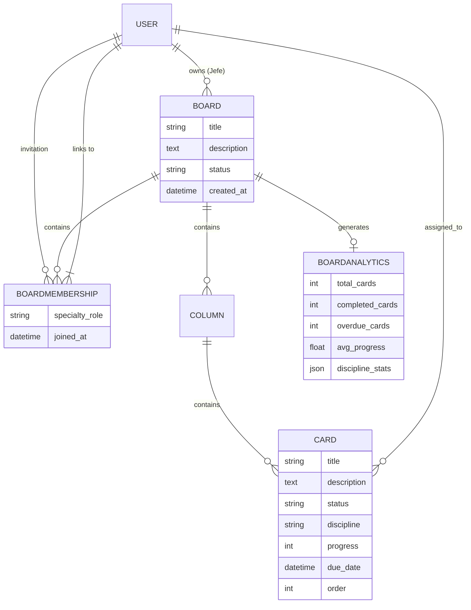

# Engineering Kanban Project Management System

A professional, engineering-focused Project Management application built with **Django 6.0** and **Bootstrap 5.3**. Specifically designed for engineering teams to manage projects through specialized discipline tracking, automated task template creation, and detailed workload monitoring.

## 🚀 Key Features

- **Modular Project Hierarchy**: Structure by Project (Board) > Columns > Tasks (Cards), split into dedicated `boards` and `teams` apps.
- **Specialized Role System**:
  - **Jefe de Ingeniería (Owner)**: Board creator with full management, member invitation, and task approval rights.
  - **Engineer Specialties**: Board members are assigned specific roles: Mechanical, Electrical, Automation, or Refrigeration.
- **Dual-Perspective Views**:
  - **Scrum View**: Classic status-based workflow (Backlog, To Do, In Progress, Review, Done).
  - **Workload View**: Resource-based perspective showing tasks by assignee with real-time overdue tracking.
- **Bulk Default Task Creation**:
  - Owners can create standardized task templates for each discipline in seconds.
  - Automatic assignment if a specialist for that discipline is on the team.
  - Integrated date selection during bulk creation.
- **Improved UX with Searchable Selection**: Includes **Select2** for efficiently managing large team invitation lists.
- **Visual Discipline Identifiers**: Colour-coded badges and border indicators matching engineering disciplines.
- **Automated Analytics Engine**: Detailed project performance records generated upon completion, tracking discipline progress and overdue trends.

## 🛠️ Technical Stack

- **Backend**: Python 3.13+, Django 6.0
- **Frontend**: HTML5, Bootstrap 5.3, Bootstrap Icons, jQuery, **Select2**
- **Database**: SQLite (Development) / PostgreSQL (Production ready)
- **Architecture**: Modular app structure (`boards`, `teams`) using Class-Based Views (CBV) and Django Signals.

## 📁 Project Structure

| App | Responsibility |
|-----|----------------|
| `boards/` | Core Kanban logic: Boards, Columns, Cards, and Analytics generation. |
| `teams/` | Member Management: Invitations, searchable member selection, and specialty roles. |
| `kanban_project/` | Global project configuration and base templates. |

## 📊 Database Schema



## ⚙️ Installation & Setup

1. **Clone the repository**:
   ```bash
   git clone <repository-url>
   cd kanban_project
   ```

2. **Set up the Virtual Environment**:
   ```bash
   python -m venv venv
   # Windows
   .\venv\Scripts\activate
   # Linux/macOS
   source venv/bin/activate
   ```

3. **Install Dependencies**:
   ```bash
   pip install -r requirements.txt
   ```

4. **Run Migrations**:
   ```bash
   python manage.py makemigrations
   python manage.py migrate
   ```

5. **Start the Development Server**:
   ```bash
   python manage.py runserver
   ```

## 🌐 Local Network Access

To allow team members on the same network to access the platform:

1. **Identify Local IP**: Run `ipconfig` (Windows) or `ifconfig` (Linux) to find your IPv4 address.
2. **Start Server**: `python manage.py runserver 0.0.0.0:8000`
3. **Access via**: `http://<your-ip>:8000`

## 📝 License

This project is open-source and available under the MIT License.
