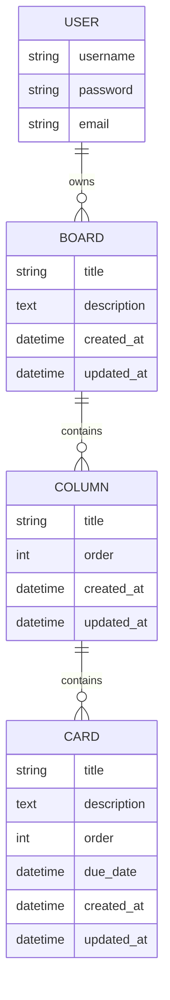

# Django Kanban Management System

A robust, professional Task Management (Kanban) application built with **Native Django** and **Tailwind CSS**. This project demonstrates clean code practices, comprehensive documentation, and a seamless user experience, making it an ideal piece for a professional developer portfolio.

## 🚀 Key Features

- **Project Management**: Create and manage multiple Kanban boards.
- **Dynamic Workflow**: Organise tasks into customisable columns (e.g., Todo, In Progress, Done).
- **Task Detailed Tracking**: Add descriptions, due dates, and maintain task order within columns.
- **User Feedback**: Integrated Django Messages framework for real-time CRUD notifications.
- **Professional Standards**: Full Type Hinting (PEP 484) and comprehensive Docstrings (PEP 257) in English.
- **Automated Documentation**: Configured with `django.contrib.admindocs` for live technical reference.
- **Clean Architecture**: Built using Class-Based Views (CBV) for maximum maintainability.

## 🛠️ Technical Stack

- **Backend**: Python 3.x, Django 6.0
- **Frontend**: HTML5, Tailwind CSS (via CDN)
- **Database**: SQLite (Development)
- **Documentation**: docutils (admindocs), Markdown
- **Diagrams**: Mermaid.js

## 📊 Database Schema



## ⚙️ Installation & Setup

1. **Clone the repository**:
   ```bash
   git clone <repository-url>
   cd TaskProject/kanban_project
   ```

2. **Set up the Virtual Environment**:
   ```bash
   python -m venv venv
   # Windows
   .\venv\Scripts\activate
   # Linux/macOS
   source venv/bin/activate
   ```

3. **Install Dependencies**:
   ```bash
   pip install -r requirements.txt
   ```

4. **Run Migrations**:
   ```bash
   python manage.py migrate
   ```

5. **Create a Superuser** (for Admin and Docs access):
   ```bash
   python manage.py createsuperuser
   ```

6. **Start the Server**:
   ```bash
   python manage.py runserver
   ```

7. **Access the App**:
   - Application: [http://127.0.0.1:8000/](http://127.0.0.1:8000/)
   - Admin Interface: [http://127.0.0.1:8000/admin/](http://127.0.0.1:8000/admin/)
   - Technical Docs: [http://127.0.0.1:8000/admin/doc/](http://127.0.0.1:8000/admin/doc/)

## 📝 Licence

This project is open-source and available under the MIT Licence.
