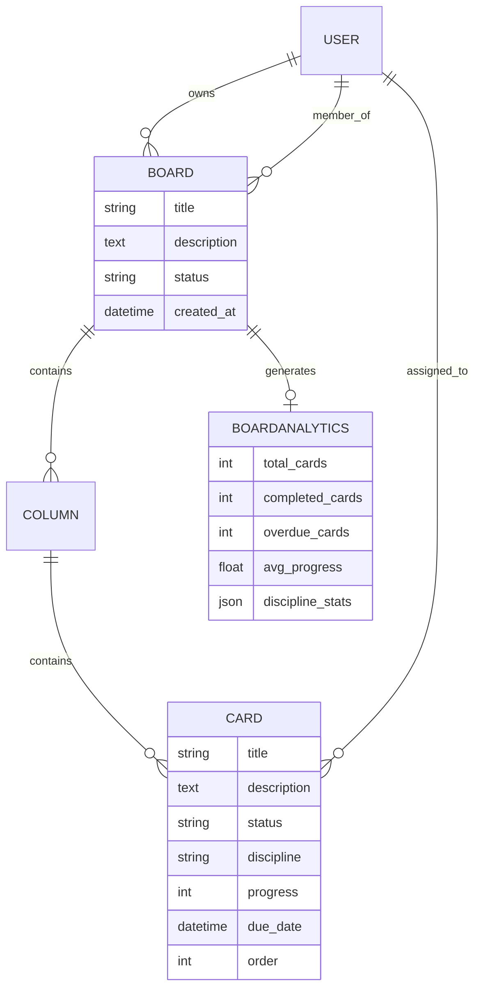

# Engineering Kanban Project Management System

A professional, engineering-focused Project Management application built with **Django 6.0** and **Bootstrap 5.3**. This system is designed for engineering teams, providing role-based task tracking, dual-view perspectives (Scrum and Workload), and automated performance analytics.

## 🚀 Key Features

- **Project Hierarchy**: Structure your work by Project (Board) > Columns > Tasks (Cards).
- **Dual-View Toggle**:
  - **Scrum View**: Classic status-based workflow (Backlog, To Do, In Progress, Review, Done).
  - **Workload View**: Resource-based perspective showing tasks assigned to each engineer with real-time overdue alerts.
- **Role-Based Access Control**:
  - **Project Owner (Jefe de Ingeniería)**: Full control over board management, member invitations, and final task approval (marks tasks as 'Done').
  - **Board Members (Engineers)**: Participate in projects, update task progress, and move cards through the workflow up to clinical review.
- **Engineering Discipline Tracking**: Categorise tasks by Mechanical, Electrical, Automation, or Refrigeration with colour-coded identifiers.
- **Automated Analytics**: Generating project performance reports upon completion, including:
  - Task completion rates.
  - Overdue task analysis.
  - Average progress per discipline.
- **Local Network Testing**: Pre-configured for team testing across a local network (LAN).

## 🛠️ Technical Stack

- **Backend**: Python 3.13+, Django 6.0
- **Frontend**: HTML5, Bootstrap 5.3, Bootstrap Icons
- **Database**: SQLite (Development)
- **Styling**: Vanilla CSS with custom engineering-themed design system
- **Architecture**: Class-Based Views (CBV) and Django Signals for secondary processing

## 📊 Database Schema



## ⚙️ Installation & Setup

1. **Clone the repository**:
   ```bash
   git clone <repository-url>
   cd TaskProject/kanban_project
   ```

2. **Set up the Virtual Environment**:
   ```bash
   python -m venv venv
   # Windows
   .\venv\Scripts\activate
   # Linux/macOS
   source venv/bin/activate
   ```

3. **Install Dependencies**:
   ```bash
   pip install -r requirements.txt
   ```

4. **Run Migrations**:
   ```bash
   python manage.py migrate
   ```

5. **Start the Server**:
   ```bash
   python manage.py runserver
   ```

## 🌐 Local Network Access

To allow other team members on the same network to access the board:

1. **Identify your Local IP**:
   Run `ipconfig` (Windows) and look for the IPv4 Address (e.g., `192.168.x.x`).

2. **Run Server specifying the IP**:
   ```bash
   python manage.py runserver 0.0.0.0:8000
   ```

3. **Access via**: `http://<your-local-ip>:8000`

## 📝 Licence

This project is open-source and available under the MIT Licence.
